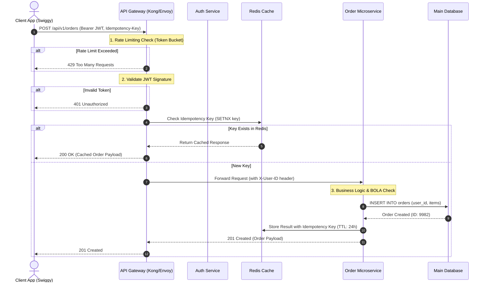

# How to Design APIs Like a Senior Engineer (REST, GraphQL, Auth, Security)

> Video Reference: [How to Design APIs Like a Senior Engineer (REST, GraphQL, Auth, Security)](https://www.youtube.com/watch?v=7iHl71nt49o)

## 1. Asli Problem Kya Hai? (The Core Why)

Maan lo tum Swiggy par India vs Pakistan match ke din **Biryani Order** kar rahe ho. Millions of users ek saath app kholte hain, cart me items add karte hain, aur payment button dabate hain. 

Agar tumne ek junior engineer ki tarah API design ki hai, toh yeh sab hoga:
1. **Network Overload (Over-fetching):** Mobile app ko sirf restaurant ka naam aur rating chahiye thi, lekin API ne poora Database row dump kar diya (including internal metadata, DB timestamps, address history). Mobile ka battery aur data dono khatam.
2. **Cascading Failures (Under-fetching):** Home screen render karne ke liye app ko 15 alag-alag REST endpoints hit karne pad rahe hain (`/user`, `/discounts`, `/cart`, `/restaurant/123`, `/delivery-agent`). Network Latency spike hogi aur server crash ho jayega.
3. **Double Deductions (Lack of Idempotency):** Network flicker hua, user ne payment button par 3 baar tap kar diya. User ke Paytm wallet se 3 baar paise kat gaye kyunki API Idempotent nahi thi.
4. **Security Breaches (BOLA / IDOR):** Kisi hacker ne API request me `/api/v1/orders/101` ki jagah `/api/v1/orders/102` pass kar diya, aur usko dusre user ka order details aur home address dikh gaya!

Senior Engineer banne ka matlab sirf code likhna nahi hai. It's about designing resilient, secure, scalable, aur maintainable APIs jo **High Throughput** aur **Low Latency** par bhi na phate.

---

## 2. Core Architecture & Mechanisms

Senior-level API design ke 5 main pillars hote hain:

### A. RESTful Best Practices & Idempotency

REST ko log galat samajhte hain. REST sirf `GET` aur `POST` ka khela nahi hai.

* **Noun-based URIs:** Endpoints hamesha resources ko represent karte hain, actions ko nahi.
  * ❌ *Bad:* `/getOrders`, `/createNewOrder`, `/deleteUser`
  * ✅ *Good:* `GET /api/v1/orders`, `POST /api/v1/orders`, `DELETE /api/v1/users/42`
* **Idempotency (Crucial for Payments/Orders):**
  * `GET`, `PUT`, `DELETE` naturally idempotent hote hain. Lekin `POST` idempotent nahi hota.
  * Solution: **Idempotency Key Pattern**. Jab client `POST /api/v1/payments` call karega, toh Header me ek unique UUID (`X-Idempotency-Key: 9b1deb4d...`) bhejega.
  * API Gateway ya Backend Redis me `SETNX` (Set if Not Exists) chalayega. Agar same key 10 sec ke andar dubara aayi, toh backend operation rerun karne ki jagah Redis se cached response wapas bhej dega.

### B. REST vs GraphQL (Choosing the Right Tool)

| Paradigm | Best Use Case | Downside |
| :--- | :--- | :--- |
| **REST** | Public APIs, File Transfers, High Throughput CRUD operations, Simple Caching (CDNs). | Over-fetching / Under-fetching ki problem. |
| **GraphQL** | Mobile Apps, Complex Dashboards jahan Client ko exact payload shape decide karna ho. | Caching mushkil hoti hai, CPU intensive parsing, **N+1 Database query problem**. |

> **Pro-Tip:** Standard microservices architecture me, **GraphQL Gateway** client-facing layer par rakha jata hai jo internal high-performance **gRPC / REST microservices** ko aggregate karta hai. N+1 problem ko solve karne ke liye **DataLoader** (Batching + Caching) pattern follow karo.

### C. Authentication & Authorization Architecture

* **Authentication (Who are you?):** Stateless **JWT (JSON Web Token)** with Short-Lived Access Tokens (15 mins) + Long-Lived Refresh Tokens (7 days). 
  * Access token ko memory/state me rakho, Refresh token ko `HttpOnly, Secure, SameSite` Cookie me store karo.
* **Authorization (What can you do?):**
  * **RBAC (Role-Based Access Control):** Admin vs Customer vs Delivery Agent.
  * **BOLA Prevention (Broken Object Level Authorization):** Har DB query me User Context Inject karo.
  * ❌ *Bad Query:* `SELECT * FROM orders WHERE order_id = req.params.id;`
  * ✅ *Good Query:* `SELECT * FROM orders WHERE order_id = req.params.id AND user_id = req.currentUser.id;`

### D. Rate Limiting & Throttling

DDoS attacks aur abusive clients se bachne ke liye API Gateway layer (Kong, Envoy, ya Nginx) par Rate Limiting lagayi jati hai.

* **Algorithms:** **Token Bucket** ya **Leaky Bucket** algorithm use hota hai.
* **Headers to return:**
  * `X-RateLimit-Limit`: 1000
  * `X-RateLimit-Remaining`: 12
  * `X-RateLimit-Reset`: 1672531199
* Status code: `429 Too Many Requests`.

### E. Pagination & Versioning

* **Offset-based Pagination:** `SELECT * FROM items LIMIT 20 OFFSET 10000;`
  * ❌ *Problem:* Database ko 10,000 rows scan karke drop karni padengi (**High Latency**). Iske alawa agar page 1 par new item insert hua, toh page 2 par duplicate items dikhenge.
* **Cursor-based Pagination (Keyset):** `SELECT * FROM items WHERE id > last_seen_id ORDER BY id ASC LIMIT 20;`
  * ✅ *Solution:* B-Tree Index ka direct lookup hota hai, Constant O(1) performance milta hai.
* **Versioning Strategy:** URL Path Versioning (`/api/v1/users`) use karo. Deprecation policy pehle se defined honi chahiye headers ke saath (`Sunset: Wed, 11 Nov 2026 00:00:00 GMT`).

---

## 3. Architecture Flow

Yeh diagram ek production-grade Enterprise API Gateway flow dikhata hai — Client Request se lekar Microservice execution tak:

---

## 4. Production Case Study

### Razorpay & Stripe: Idempotent Payment API Engine

Payment gateways me sabse badi tension hoti hai **Network Timeout**. Maan lo user ne payment ki, bank se paise kat gaye, lekin backend Response bhejne se pehle network disconnect ho gaya. Client dubara Retry karega.

**Razorpay/Stripe Kaise Handle Karte Hain?**

1. **Distributed Lock (Redis Redlock):** Jab koi request `X-Idempotency-Key: pay_tx_8812` ke saath aati hai, Redis me ek distributed lock set ho jata hai.
2. **State Machine Tracking:**
   * Status `PROCESSING`: Agar same key se second request aati hai jab pehli process ho rahi ho, toh API `409 Conflict` ya polling response bhejti hai.
   * Status `COMPLETED`: Result Redis aur Persistent DB dono me save ho jata hai. Subsequent retries par seedha cached response `200 OK` chala jata hai bina DB ya Payment Bank Gateway ko hit kiye.
3. **Database Transaction Isolation:** Payment DB write `SERIALIZABLE` ya `READ COMMITTED` with Row-level Locks (`SELECT FOR UPDATE`) ke sath hoti hai taaki race conditions se account balance negative na chala jaye.

---

## 5. Trade-offs (Pros vs Cons)

| Architecture Choice | Pros | Cons |
| :--- | :--- | :--- |
| **REST APIs** | • Super easy caching (CDN level) • Simple, mature tooling • Standard HTTP semantics | • Over-fetching/Under-fetching issues • Multiple round trips required for complex views |
| **GraphQL** | • Single endpoint, zero over-fetching • Strong Schema Typing (Schema Driven Development) • Ideal for diverse frontend devices | • Caching is extremely hard (HTTP POST only) • High CPU utilization on server for query parsing • Risk of deep nested malicious queries |
| **JWT (Stateless Auth)** | • No DB lookup per request (Fast) • Scales horizontally seamlessly | • Cannot revoke token instantly before expiry (without blacklist state) |
| **Cursor Pagination** | • Fast performance (O(1)) on large tables • Consistent data view while scrolling | • Random page jump impossible (Page 1 se direct Page 50 par nahi ja sakte) |

---

## 6. System Design Interview Cheat Sheet

Jab System Design interview me API Design ka question aaye, toh in 5 point checklist ko hamesha zahan me rakhna:

1. **Contract First Design:** Interviewer ko bolo ki tum pehle Open API Specification (Swagger) define karoge URI, Verbs, Headers (`Authorization`, `X-Correlation-ID`, `X-Idempotency-Key`), aur Status Codes (`200`, `201`, `400`, `401`, `403`, `404`, `429`, `500`) ke saath.
2. **Never Trust the Client:** Security layers define karo — Client-side validation is UX, Server-side validation is Security. Authorization (BOLA/IDOR) check hamesha DB/Service layer par hoga.
3. **Handle Edge Cases at Scale:** Mention karo ki Write APIs par **Idempotency Key** lagao (using Redis) aur High-Traffic endpoints par **Rate Limiting** (Token Bucket) aur **Circuit Breaker** (Resilience4j / Hystrix) use karoge.
4. **Pagination Strategy:** Real-time / Large Datasets ke liye hamesha **Cursor-based pagination** select karo instead of `OFFSET-LIMIT`.
5. **Observability & Distributed Tracing:** API Gateway level par har request ko ek unique `X-Request-ID` / `X-Correlation-ID` assign karo, taaki logs me request ka poora journey (Microservices ke aam-saamne) trace ho sake (Jaeger / Zipkin / Datadog).
