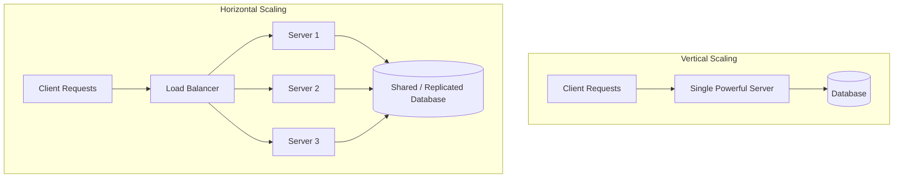

# Vertical vs Horizontal Scaling

> Video Reference: [Vertical vs Horizontal Scaling](https://www.youtube.com/watch?v=xpDnVSmNFX0)

## 1. Asli Problem Kya Hai? (The Core Why)

Socho tum Swiggy ke backend team mein ho. Normal din pe tumhare server pe
2,000 requests/second aate hain, aur sab smooth chal raha hai. Ab IPL final ka
din hai, aur order-placing traffic achanak 10x ho gaya — 20,000 requests/second.
Tumhara single server, jo pehle theek-thaak handle kar raha tha, ab CPU aur
memory dono pe gasp le raha hai. Latency badhne lagti hai, requests timeout
hone lagti hain, aur users ko "Order fail ho gaya" dikhne lagta hai.

Yahi wo core problem hai jise **scaling** solve karta hai: jab load badhta hai,
system ko bina crash kiye, bina latency badhaye, us load ko handle karna aana
chahiye. Sawaal sirf itna hai — tum yeh scaling **kaise** karoge? Yahi pe
Vertical aur Horizontal Scaling ka concept aata hai.

## 2. Core Architecture & Mechanisms

### Vertical Scaling (Scaling Up)

Vertical Scaling ka matlab hai: same machine ko **zyada powerful** banao. Agar
tumhara server 8 GB RAM aur 4 CPU cores pe chal raha hai, to tum usko upgrade
karke 64 GB RAM aur 16 CPU cores wala bana do. Ek tarah se, tum apne ek hi
ghode ko zyada taakatwar bana rahe ho, instead of aur ghode laane ke.

Yeh approach simple hai — code mein koi change nahi chahiye, distributed
systems ki complexity nahi aati. Lekin iski ek hard **ceiling** hai: ek machine
sirf itni hi powerful ban sakti hai. Aur agar wo single machine down ho gayi,
to poora system down ho jaata hai — koi **redundancy** nahi hai.

### Horizontal Scaling (Scaling Out)

Horizontal Scaling ka matlab hai: ek machine ko powerful banane ke bajaye,
**zyada machines add karo**. Ab tumhare paas ek server ke bajaye 10 servers
hain, aur ek **Load Balancer** in sabke beech traffic ko distribute karta hai.

Isme Throughput almost linearly badhta hai — jitne zyada servers, utna zyada
load handle ho sakta hai. Aur agar ek server crash ho jaaye, baaki servers
kaam karte rehte hain — system resilient ban jaata hai.

Lekin iski apni complexity hai: ab tumhe **stateless services** design karni
padti hain (kyunki request kisi bhi server pe ja sakti hai), database ko bhi
distributed banana padta hai (jaise Read Replicas ya Sharding ke through), aur
inter-server communication, service discovery jaisi cheezein manage karni
padti hain.

### Kab Kya Use Karo?

Zyaadatar real-world systems **dono ka mix** use karte hain. Database ko
thoda vertical scale karte hain (kyunki distributed databases complex hote
hain), jabki stateless application servers ko horizontally scale karte hain
(kyunki wahan par load balance karna aasaan hai).

## 3. Architecture Flow

## 4. Production Case Study

**Uber** ka ride-matching system ek achha real-world example hai. Peak hours
mein (jaise office time ya raat ko party rush), ride requests ka volume kai
guna badh jaata hai. Uber apne matching aur pricing services ko **horizontally**
scale karta hai — Kubernetes ke zariye automatically naye pods (server
instances) spin up ho jaate hain jab traffic badhta hai, aur load kam hote hi
wapas scale down ho jaate hain (isse **auto-scaling** kehte hain).

Wahi doosri taraf, unke kuch core transactional databases jo strong
consistency maangte hain, unhe kaafi hadd tak vertically scaled powerful
machines pe rakha jaata hai, kyunki distributed transactions manage karna
bahut complex ho sakta hai.

## 5. Trade-offs (Pros vs Cons)

| Pros | Cons |
|---|---|
| **Vertical**: Simple to implement, no code changes needed | **Vertical**: Hard hardware ceiling — ek limit ke baad aur upgrade nahi ho sakta |
| **Vertical**: No distributed systems complexity | **Vertical**: Single Point of Failure — machine down toh sab down |
| **Horizontal**: Near-linear scalability, virtually unlimited growth | **Horizontal**: Requires stateless design, adds architectural complexity |
| **Horizontal**: Better fault tolerance and redundancy | **Horizontal**: Needs load balancing, service discovery, and distributed data handling |

## 6. System Design Interview Cheat Sheet

- **Vertical Scaling** = ek machine ko upgrade karna (more CPU/RAM); simple but has a hard ceiling and no redundancy.
- **Horizontal Scaling** = zyada machines add karna; needs a Load Balancer and stateless services.
- Horizontal scaling gives better fault tolerance kyunki ek server fail ho to baaki chalte rehte hain.
- Databases often scale vertically (or via Sharding/Read Replicas) because distributed consistency is hard.
- Real systems usually use a **hybrid approach**: horizontal scaling for stateless app servers, careful vertical + replication strategies for the database layer.
