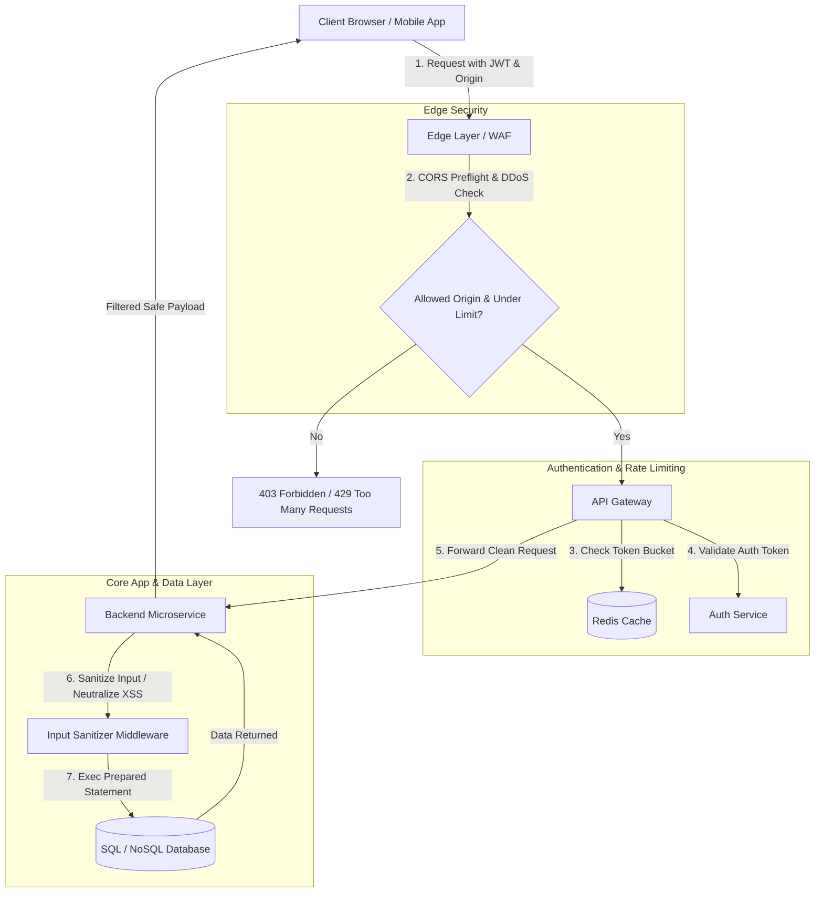

# API Security Explained: Rate Limiting, CORS, SQL Injection, CSRF, XSS & More

> Video Reference: [API Security Explained: Rate Limiting, CORS, SQL Injection, CSRF, XSS & More](https://www.youtube.com/watch?v=FsB_nRGdeLs)

## 1. Asli Problem Kya Hai? (The Core Why)

Maan lo IPL Final Match ki ticket booking **BookMyShow** ya **Paytm** par shuru hone wali hai. 10 lakh fans ek saath site par aate hain. Lekin un 10 lakh fans ke piche kuch malicious actors (scalpers/hackers) bhi hain jo python scripts aur automated bots chala rahe hain.

Agar tumne apne APIs ko secure nahi kiya, toh yeh teen cheezein hongi:
1. **DDoS & Resource Exhaustion:** Script-kiddies ek second mein 50,000 requests bhej kar tumhare Database aur Backend servers ko crash kar denge (Rate Limiting ki kami).
2. **Data Theft & Account Takeover:** Attacker backend query mein chalaki se `OR 1=1` bhej kar pure user database ka dump nikal lega (SQL Injection) ya user ke browser mein script execute karke session cookies churaye ga (XSS).
3. **Unauthorized Actions:** User Tatkal ticket book kar raha hoga, aur background mein ek malicious site user ki taraf se Paytm wallet se paise transfer kar legi (CSRF).

API Security koi "afterthought" ya extra feature nahi hai. System Design mein jab tum System Availability aur Data Integrity ki baat karte ho, toh API Security uska foundational pillar hoti hai.

---

## 2. Core Architecture & Mechanisms

API security ko samajhne ke liye hume iske alag-alag layers aur vulnerabilities ko deeply samajhna padega:

### A. Rate Limiting (Preventing Abuse & Cascading Failures)
Rate Limiting decide karta hai ki ek client (IP, User ID, ya API Key) ek specific time window mein kitni requests bhej sakta hai.

*   **Token Bucket Algorithm:** Ek bucket hoti hai jisme fixed capacity ke tokens hote hain. Pre-defined rate par bucket mein tokens add hote rehte hain. Jab bhi koi request aati hai, woh ek token consume karti hai. Bucket khaali? Request reject (`429 Too Many Requests`).
*   **Sliding Window Log / Counter:** Distributed systems mein **Redis** ka use karke timestamp-based sliding window maintain ki jaati hai taaki exact time-frame (e.g., 100 req/minute) enforce ho sake.

### B. CORS (Cross-Origin Resource Sharing)
CORS backend security feature **nahi** hai, yeh ek **Browser-level Security Mechanism** hai.
*   By default, browsers **Same-Origin Policy (SOP)** follow karte hain. Agar tumhara frontend `frontend.com` par hai aur backend `api.backend.com` par, toh browser ek preflight request (`OPTIONS`) bhejta hai.
*   Backend se Response Headers aate hain:
    *   `Access-Control-Allow-Origin: https://frontend.com`
    *   `Access-Control-Allow-Methods: GET, POST, PUT`
*   Agar backend cross-origin domain ko trust nahi karta, toh browser frontend JavaScript ko response read nahi karne deta.

### C. SQL Injection (SQLi)
Jab backend application untrusted user input ko directly SQL query string ke saath concatenate (jod) kar deti hai.
*   **Vulnerable Query:** `SELECT * FROM users WHERE username = '` + userInput + `' AND password = '` + pass + `'`
*   **Attack Payload:** User input = `' OR '1'='1`
*   **Fix:** **Parameterized Queries / Prepared Statements** use karo. Query ka execution plan pehle se compile hota hai, aur user input ko sirf pure DATA ki tarah treat kiya jata hai, executable code ki tarah nahi.

### D. XSS (Cross-Site Scripting)
XSS tab hota hai jab ek attacker application ke andar malicious JavaScript code inject kar deta hai, jo baaki victims ke browsers mein execute hota hai.
*   **Stored XSS:** Comment section mein attacker `` daal deta hai. Yeh DB mein save ho jata hai aur har visit karne waale user ke browser mein run hota hai.
*   **Fix:** Input Sanitization (e.g., DOMPurify), Output Encoding (converting `<` to `&lt;`), aur HTTP-Only Cookies (jisse JS `document.cookie` ko read na kar sake).

### E. CSRF (Cross-Site Request Forgery)
CSRF attacker ko yeh allow karta hai ki woh ek authenticated user ke browser se unauthorized requests backend par bhej sake.
*   **Scenario:** Tum Paytm par logged in ho. Tumne ek malicious website open ki. Woh site background mein stealthily form submit karti hai: `POST https://paytm.com/transfer?to=attacker&amount=10000`. Browser automatically Paytm ke session cookies attach kar ke request bhej dega!
*   **Fix:** 
    1. **Anti-CSRF Tokens:** State-changing requests ke saath ek unique, cryptographically secure token bhejho.
    2. **SameSite Cookie Attribute:** Cookies ko `SameSite=Strict` ya `SameSite=Lax` set karo taaki third-party origin se cookies attach na hon.

---

## 3. Architecture Flow

Niche diya gaya flow dikhata hai ki kaise ek API Request Multiple Security Layers (API Gateway se Database tak) se guzarti hai:

---

## 4. Production Case Study

### Uber: Distributed API Gateway with Rate Limiting & Input Protection

Uber rozana billions of API calls handle karta hai (Driver Location Updates, Rider Requests, Payment Gateways).

1.  **Rate Limiting at Edge (Envoy Proxy + Redis):**
    *   Uber edge proxy layer par **Envoy** use karta hai. Har request ke arrival par, Envoy central **Redis Cluster** ko atomic scripts (Lua) ke zariye query karta hai.
    *   Uber ne per-user, per-ip, aur per-route limits set kar rakhi hain. Dynamic Rate Limiting algorithm use hota hai—agar kisi specific city (e.g., Mumbai) mein traffic burst hota hai, toh limits dynamically adjust hoti hain taaki core dispatching latency badhe bina surge survive ho jaye.

2.  **Input Validation & SQLi/XSS Shielding:**
    *   Uber ek strict **Schema Validation Engine** (JSON Schema + Protobuf) use karta hai. Gateway level par hi agar API payload predefined schema se mismatch karta hai (e.g., String ki jagah unexpected script/character payloads), toh request microservices tak pahunchne se pehle hi terminate ho jaati hai.
    *   All internal DB access layers enforce **ORM Parameterization** mandatory static code analysis checks (CI/CD pipeline mein Checkmarx/SonarQube) ke saath, jisse zero un-parameterized SQL queries production tak pahunche.

---

## 5. Trade-offs (Pros vs Cons)

| Feature / Mechanism | Pros (Fayde) | Cons (Nuksan / Complexity) |
| :--- | :--- | :--- |
| **Strict Rate Limiting** | Server resource exhaustion aur DDoS attacks se bachata hai; Cost control mein rehta hai. | Legitimate traffic block hone ka risk (False Positives) agar bursts correctly tune na hon. |
| **WAF & Input Sanitization** | SQLi aur Stored/Reflected XSS attacks ko application logic se pehle hi rok deta hai. | API Latency mein 5-15ms ka addition hota hai; complex payload processing compute-heavy hoti hai. |
| **SameSite Cookies & CSRF Tokens** | Cross-site unauthorized transactions ko 100% stop kar deta hai. | Cross-domain integrations (e.g., Embedded Widgets, Third-party iFrames) ka setup complex ho jata hai. |
| **Strict CORS Policies** | Unauthorized websites ko user ke behalf par private API responses read karne se rokta hai. | Misconfiguration (like `Access-Control-Allow-Origin: *`) se false sense of security milti hai; Debugging tough hoti hai. |

---

## 6. System Design Interview Cheat Sheet

Interview mein jab API Security par discussion ho, toh yeh 5 points hamesha tip-of-the-tongue hone chahiye:

1.  **Rate Limiting Location:** Rate limiting hamesha **API Gateway / Edge Proxy** level par lagao using **Redis** (Token Bucket or Sliding Window algorithm). Individual microservices par mat chhodo.
2.  **SQL Injection Defense:** Simple answer is **Prepared Statements / Parameterized Queries**. Plain-text string concatenation with dynamic inputs is a strict NO.
3.  **XSS Protection Hierarchy:** Dual layer protection approach—Input sanitization on backend, **Output Encoding** on frontend, plus `HttpOnly` flags for sensitive cookies (like Refresh Tokens).
4.  **CSRF Mitigation:** SPA + REST API architecture mein **Header-based Auth Tokens (JWT in Auth Header)** or **SameSite=Strict Cookies** + Anti-CSRF tokens use karo.
5.  **Defense in Depth Strategy:** Never rely on a single line of defense. Security should be layered: **WAF → Edge Rate Limiter → Auth Gateway → Input Middleware → Parameterized DB Access Layer**.
