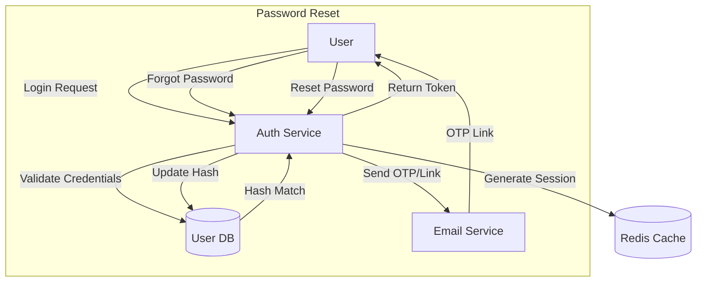
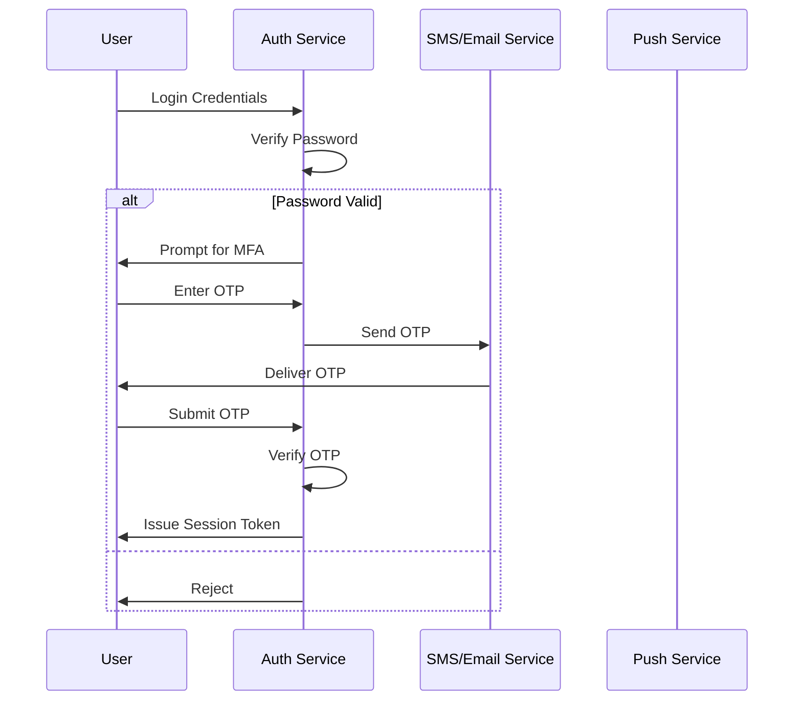
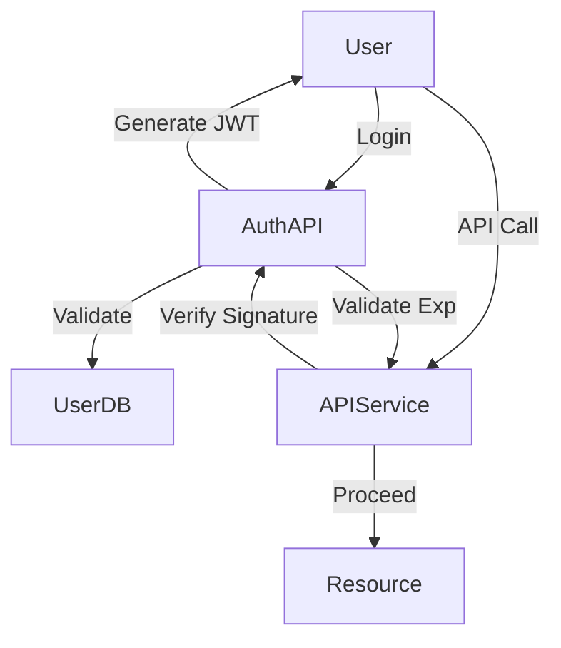
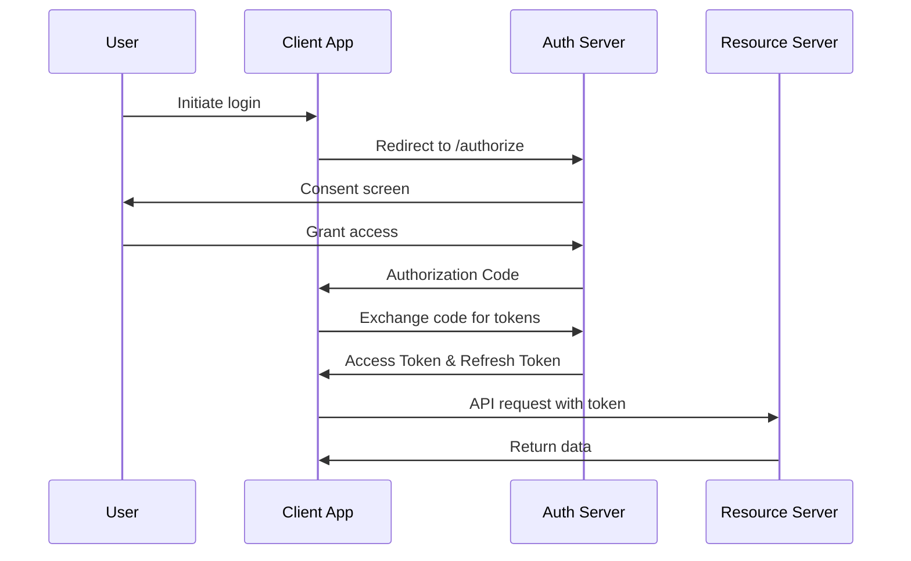
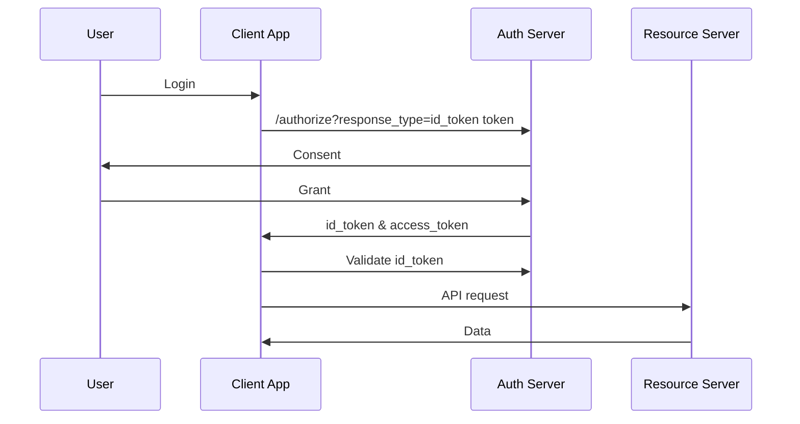
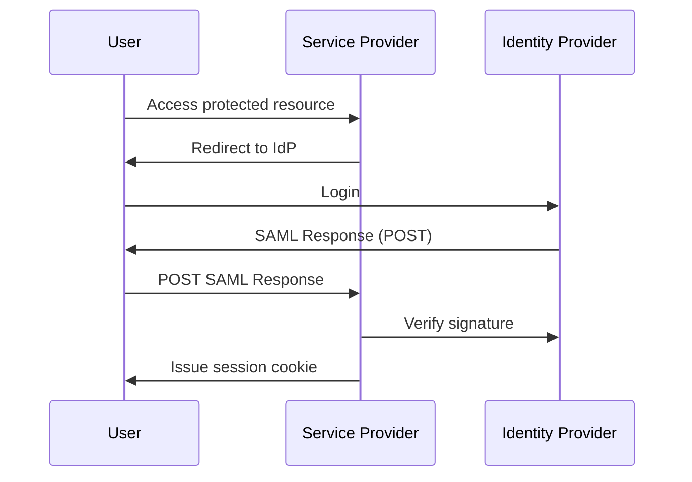
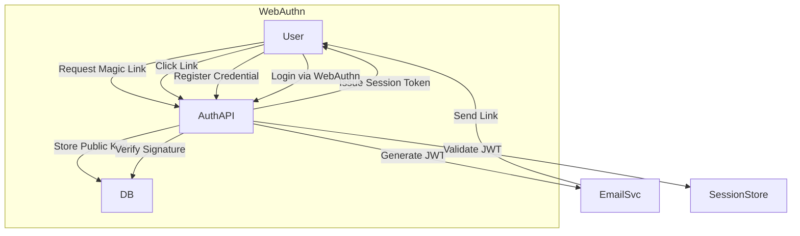

# 7 Authentication Concepts Every Developer Should Know

> Video Reference: [7 Authentication Concepts Every Developer Should Know](https://www.youtube.com/watch?v=iX8g4LqF8p8)

---

## 1. Password‑Based Authentication

### 1. Asli Problem Kya Hai? (The Core Why)
Swiggy ka order place karte waqt agar user ko password reset karna padta hai, toh woh frustration se app ko uninstall kar sakta hai. Passwords ka reuse, weak policies aur credential stuffing attacks se user accounts compromise ho jaate hain. Agar yeh solve na kiya jaye toh data breaches, brand damage aur legal penalties ka risk badh jata hai.

### 2. Core Architecture & Mechanisms
- **Hashing with Salt**: bcrypt/Argon2 use karke password ko securely store karte hain. Salt random hota hai, isse rainbow tables kaam nahi karte.  
- **Rate Limiting & Account Lockout**: Har failed login ke baad delay increase hota hai. 5 continuous failures ke baad account temporarily lock.  
- **Password Reset Flow**: Forgot password ke liye OTP ya email link bheja jata hai. Reset link 15‑minute expiry rakha jata hai.  
- **Password Policy**: Minimum length, mix of upper/lower, digits, special chars. User ko feedback milta hai.  
- **Audit Logging**: All auth events (success/failure) ko audit trail me store kiya jata hai.

### 3. Architecture Flow

### 4. Production Case Study
**Swiggy**:  
- Uses Argon2id for hashing, 12 rounds.  
- Implements account lockout after 5 attempts.  
- Password reset email includes one‑time link with JWT signed by HS256, expires in 10 minutes.

**Paytm**:  
- Uses OTP‑based password reset to mitigate phishing.  
- Stores password hash in a dedicated microservice with strict RBAC.

### 5. Trade‑offs (Pros vs Cons)

| Pros | Cons |
|------|------|
| Simple to implement and understand. | Weak passwords lead to easy compromise. |
| No extra infrastructure beyond DB. | Password reuse across sites increases risk. |
| Users are familiar with the flow. | Password reset delays can frustrate users. |
| Can be combined with MFA for extra safety. | Requires regular password policy enforcement. |

### 6. System Design Interview Cheat Sheet
- Hash passwords with strong algorithms (bcrypt, Argon2) + salt.  
- Implement rate limiting and account lockout.  
- Use JWT or session tokens for stateless auth.  
- Store reset tokens with short expiry and one‑time use.  
- Log all auth events for audit and anomaly detection.

---

## 2. Multi‑Factor Authentication (MFA)

### 1. Asli Problem Kya Hai? (The Core Why)
SIM swapping, phishing, aur credential stuffing se single‑factor login se accounts compromise ho jaate hain. Users ko ek additional proof (OTP, push, biometrics) dene se security dramatically improve hoti hai, especially high‑value platforms like Zerodha.

### 2. Core Architecture & Mechanisms
- **OTP via SMS/Email**: Time‑bound numeric code.  
- **TOTP (Authenticator App)**: 30‑second sliding window.  
- **Push Notifications**: Real‑time approval via app.  
- **Backup Codes**: One‑time use, stored encrypted.  
- **Device Trust**: Fingerprint/FaceID via WebAuthn for passwordless MFA.

### 3. Architecture Flow

### 4. Production Case Study
**Zerodha**:  
- Uses OTP via SMS for each login, plus push approval for high‑value trades.  
- Stores OTPs in Redis with 5‑minute TTL.  

**Paytm**:  
- Implements "One Touch" push approval for payments > ₹1000.  
- Uses device fingerprinting to detect anomalies.

### 5. Trade‑offs (Pros vs Cons)

| Pros | Cons |
|------|------|
| Significantly reduces account takeover. | User friction increases login time. |
| SMS/Email OTP is cheap and widely available. | SMS delays or network issues cause frustration. |
| Push approvals are instant and user‑friendly. | Requires mobile app, not all users have one. |
| Backup codes add a safety net. | Must be securely stored by users. |

### 6. System Design Interview Cheat Sheet
- Use TOTP for low‑cost, high reliability.  
- SMS OTP only as fallback; push is preferred.  
- Store OTPs in Redis with short TTL.  
- Implement device trust via WebAuthn for passwordless MFA.  
- Provide secure backup codes and educate users.

---

## 3. Token‑Based Authentication (JWT)

### 1. Asli Problem Kya Hai? (The Core Why)
Traditional session cookies require server‑side session store, leading to scalability bottlenecks. Stateless APIs (e.g., Uber’s mobile backend) need a way to verify user identity without hitting DB on every request.

### 2. Core Architecture & Mechanisms
- **JWT Payload**: `sub`, `iat`, `exp`, `roles`.  
- **Signing Algorithms**: HS256 for small services, RS256 for distributed microservices.  
- **Token Revocation**: Blacklist in Redis or use short `exp` + refresh token.  
- **Refresh Tokens**: Stored securely, rotated upon use.  

### 3. Architecture Flow

### 4. Production Case Study
**Uber**:  
- Uses RS256 signed JWTs with 15‑minute expiry.  
- Refresh token stored in secure cookie, rotated every 30 days.  

**Netflix**:  
- Issues short‑lived access tokens (5 mins) + long‑lived refresh tokens.  
- Revokes tokens via a global blacklist in Redis when user logs out.

### 5. Trade‑offs (Pros vs Cons)

| Pros | Cons |
|------|------|
| Stateless, no session store needed. | Revocation is hard; compromised token stays valid until expiry. |
| Scalable across microservices. | Token size adds to request headers. |
| Works well with CDN and edge caching. | Requires careful key management. |
| Allows offline verification. | Auditing requires additional logs. |

### 6. System Design Interview Cheat Sheet
- Keep JWT payload minimal to reduce size.  
- Use RS256 for distributed signing; rotate keys.  
- Store refresh tokens securely, rotate on use.  
- Implement token blacklist for immediate revocation.  
- Ensure clock skew tolerance (±5 mins) in `exp` validation.

---

## 4. OAuth 2.0

### 1. Asli Problem Kya Hai? (The Core Why)
Third‑party apps (e.g., a fitness tracker) ko limited access chahiye without sharing user password. Direct credential sharing is insecure and violates principle of least privilege.

### 2. Core Architecture & Mechanisms
- **Authorization Server**: Issues tokens.  
- **Resource Server**: Hosts protected APIs.  
- **Client**: Third‑party app requesting access.  
- **Grant Types**: Authorization Code (web), Client Credentials, Implicit, Resource Owner Password.  
- **PKCE**: Protects Authorization Code flow on public clients.  

### 3. Architecture Flow

### 4. Production Case Study
**Google (Swiggy Login)**:  
- Swiggy uses Google’s OAuth 2.0 to allow users to login with Gmail.  
- Implements PKCE for native app integration.  

**Amazon**:  
- Provides OAuth 2.0 for third‑party developers to access AWS services (e.g., S3).  
- Uses client credentials grant for machine‑to‑machine communication.

### 5. Trade‑offs (Pros vs Cons)

| Pros | Cons |
|------|------|
| Delegated access, granular scopes. | Complexity of implementation and maintenance. |
| Users can revoke access per app. | Redirect URI misconfigurations lead to CSRF attacks. |
| Supports many grant types for different scenarios. | Requires secure storage of client secrets. |
| Widely adopted, ecosystem support. | Requires PKCE for public clients, else vulnerable. |

### 6. System Design Interview Cheat Sheet
- Use Authorization Code + PKCE for native/public clients.  
- Store client secrets securely; rotate regularly.  
- Implement scopes and fine‑grained permissions.  
- Use refresh tokens with rotation and revocation.  
- Protect redirect URIs and use state parameter for CSRF.

---

## 5. OpenID Connect

### 1. Asli Problem Kya Hai? (The Core Why)
OAuth 2.0 provides authorization but not identity information. Apps need user profile data (name, email) securely, without building an in‑house identity provider.

### 2. Core Architecture & Mechanisms
- **ID Token**: JWT containing user identity claims.  
- **UserInfo Endpoint**: Optional endpoint to fetch profile data.  
- **Claims**: `sub`, `email`, `name`, `picture`.  
- **Implicit vs Hybrid Flow**: For SPAs and mobile apps.  

### 3. Architecture Flow

### 4. Production Case Study
**Paytm**:  
- Uses OpenID Connect for SSO across its services (wallet, banking, merchant portal).  
- Stores `id_token` in secure cookie, refreshes via silent authentication.

**Zomato**:  
- Implements OIDC with Google & Facebook for quick login.  
- Uses `UserInfo` endpoint to fetch email and profile picture.

### 5. Trade‑offs (Pros vs Cons)

| Pros | Cons |
|------|------|
| Adds identity layer on OAuth; easy SSO. | Additional token overhead. |
| Claims are standardized; reduces custom logic. | Requires trust in IdP; potential privacy concerns. |
| Supports session management via `sid`. | Complexity of handling token revocation. |
| Widely supported in libraries. | Need to handle token expiry and refresh. |

### 6. System Design Interview Cheat Sheet
- Always validate `iss`, `aud`, and `exp` in ID token.  
- Use `nonce` to mitigate replay attacks.  
- Prefer `RS256` for ID token signing.  
- Cache user profile data to reduce `UserInfo` calls.  
- Handle silent authentication for refresh.

---

## 6. SAML (Security Assertion Markup Language)

### 1. Asli Problem Kya Hai? (The Core Why)
Enterprise SSO requires a protocol that can interoperate across heterogeneous systems (Java, .NET, Linux). XML‑based assertions allow rich attribute exchange for role‑based access control.

### 2. Core Architecture & Mechanisms
- **Identity Provider (IdP)**: Issues signed SAML assertions.  
- **Service Provider (SP)**: Consumes assertions to authenticate users.  
- **Assertions**: Contain `AuthenticationStatement`, `AttributeStatement`.  
- **Bindings**: HTTP‑Redirect, HTTP‑POST, Artifact.  
- **Certificate Rotation**: For signing/encryption.  

### 3. Architecture Flow

### 4. Production Case Study
**IRCTC**:  
- Uses SAML SSO for partner booking portals.  
- IdP is a custom solution built on Shibboleth; SPs use Spring Security.  

**Government of India**:  
- Implements SAML for e‑services (e‑GST, PAN portal).  
- Supports multi‑factor via OTP on IdP side.

### 5. Trade‑offs (Pros vs Cons)

| Pros | Cons |
|------|------|
| Enterprise‑grade, role‑based assertions. | XML parsing overhead. |
| Strong security via X.509 signatures. | Larger payloads, slower. |
| Supports cross‑domain authentication. | Requires certificate management. |
| Widely supported by legacy systems. | Less friendly for mobile apps. |

### 6. System Design Interview Cheat Sheet
- Use HTTP‑POST binding for security; avoid Redirect for sensitive data.  
- Sign assertions with X.509 cert; rotate keys periodically.  
- Store session in a stateless token if possible.  
- Validate audience, issuer, and time constraints.  
- Cache SAML metadata to avoid repeated fetches.

---

## 7. Passwordless Authentication (Biometric, OTP Magic Links)

### 1. Asli Problem Kya Hai? (The Core Why)
Password fatigue, phishing, and credential stuffing make password‑based login risky. Users prefer seamless login experiences like “magic link” or biometric unlock.

### 2. Core Architecture & Mechanisms
- **WebAuthn (FIDO2)**: Public‑key credentials stored in device; no password.  
- **OTP Magic Link**: Email link containing one‑time JWT.  
- **Biometric (FaceID/TouchID)**: Device‑level authentication integrated with WebAuthn.  
- **Device Fingerprint**: Browser fingerprint + device ID for risk scoring.  

### 3. Architecture Flow

### 4. Production Case Study
**Airtel UPI**:  
- Uses biometric unlock for transaction approval.  
- Magic links sent for one‑time login to the UPI app.  

**Paytm**:  
- Offers “Paytm ID” login via magic link for quick checkout.  
- Stores device fingerprint to detect anomalies.

### 5. Trade‑offs (Pros vs Cons)

| Pros | Cons |
|------|------|
| No passwords → no credential reuse. | Device dependency; lost device requires recovery flow. |
| Faster login → higher conversion rates. | Requires modern browsers or native apps. |
| Strong cryptographic proof of possession. | Implementation complexity, key management. |
| Reduced support tickets for password resets. | Magic link delays if email delivery is slow. |

### 6. System Design Interview Cheat Sheet
- Use WebAuthn for web apps; fallback to magic link for email.  
- Store public keys in a dedicated credential store.  
- Sign magic link JWT with short expiry (5‑10 mins).  
- Implement device fingerprinting for risk scoring.  
- Provide secure recovery flow (phone OTP or support ticket).

---
