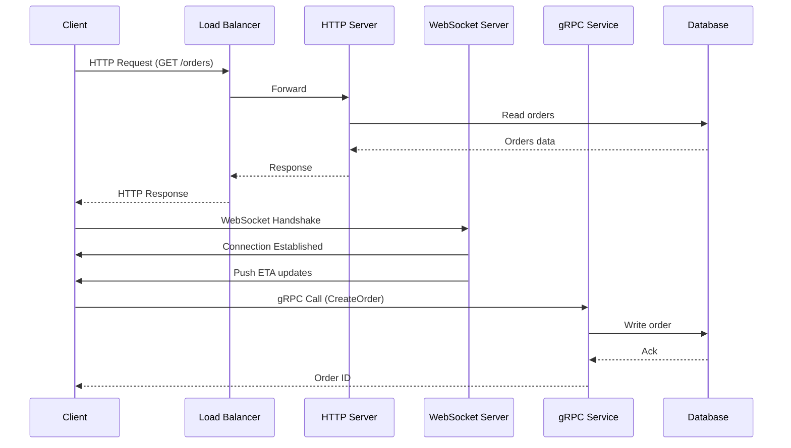

# API Protocols Explained: When to Use HTTP, WebSockets, gRPC & More

> Video Reference: [API Protocols Explained: When to Use HTTP, WebSockets, gRPC & More](https://www.youtube.com/watch?v=lcPcyNAEZgo)

## 1. Asli Problem Kya Hai? (The Core Why)

Imagine **Swiggy**’s order flow during peak hours. Har ek customer ka order, driver ka location update, menu refresh, aur promo notification ek saath hit ho rahe hote hain. Agar hum sirf HTTP REST ka use karein, to:

- **Latency** badh jayega because every update requires a new HTTP request.
- **Throughput** choke ho jayega due to connection overhead.
- **Real‑time** updates (driver ETA, seat availability on IRCTC) miss ho jayenge.

Iske bina Swiggy customers ko “Order Placed” ke baad bhi “Your driver is 2 mins away” ka real‑time feedback nahi mil paata. Result: users churn, revenue drop. Same story with **IRCTC** where seat availability must be instant across millions of concurrent users.

## 2. Core Architecture & Mechanisms

### HTTP (REST)

- **Stateless**: each request contains all needed info.
- **Cacheable**: use CDN, ETag, etc. for read‑heavy endpoints.
- **Simple**: easy to debug, wide tooling support.
- **Use case**: CRUD operations, billing, user profiles.

### WebSockets

- **Full‑duplex**: server can push data whenever it wants.
- **Low latency**: no HTTP handshake per message.
- **Stateful**: connection stays alive, good for real‑time chats or driver location streams.
- **Use case**: Swiggy driver ETA, WhatsApp chat, real‑time stock ticker.

### gRPC

- **Binary protocol (Protocol Buffers)**: smaller payload, faster serialization.
- **Streaming**: client‑stream, server‑stream, bidirectional streaming.
- **Strong typing**: compile‑time contracts.
- **Use case**: microservice inter‑communication (service‑to‑service), high‑throughput telemetry, IoT data ingestion.

### Others

- **GraphQL**: client chooses fields, reduces over‑fetching.
- **Server‑Sent Events (SSE)**: unidirectional real‑time stream, lighter than WebSockets.
- **MQTT / AMQP**: message queues for decoupled systems.

## 3. Architecture Flow

## 4. Production Case Study

### Uber – Real‑time Driver Tracking

- **Protocol**: WebSockets (via `socket.io`).
- **Why**: Need instant ETA and driver location to update the rider’s app every second.
- **Result**: 5‑10 ms latency, 99.9% availability through multi‑region WebSocket clusters.

### Netflix – Microservice Communication

- **Protocol**: gRPC.
- **Why**: Hundreds of microservices exchanging telemetry and recommendation data at high throughput.
- **Result**: 2× reduction in payload size, 30% lower CPU usage compared to JSON over HTTP.

### Paytm – Payment API

- **Protocol**: HTTPS (REST + OAuth2).
- **Why**: Security (TLS), idempotency, audit trail, compliance with PCI-DSS.
- **Result**: 99.99% uptime, easy integration with banks’ APIs.

## 5. Trade‑offs (Pros vs Cons)

| **Pros** | **Cons** |
|----------|----------|
| **HTTP** – Simple, cacheable, wide tooling, stateless → easier scaling with CDN and load balancers. | **HTTP** – No real‑time push, higher latency for frequent updates, connection overhead. |
| **WebSockets** – Low latency, full‑duplex, real‑time UI updates (driver ETA, chat). | **WebSockets** – Stateful, harder to scale horizontally, firewall/NAT traversal issues. |
| **gRPC** – Binary, low bandwidth, strong typing, streaming, efficient microservice comm. | **gRPC** – Requires protobuf, less human‑readable, tooling less mature for browsers. |
| **GraphQL** – Client chooses fields → less over‑fetching. | **GraphQL** – Complex caching, query complexity can hurt performance. |
| **SSE** – Simple server‑to‑client streaming, works over HTTP. | **SSE** – Unidirectional, no client‑to‑server push. |
| **MQTT / AMQP** – Decoupled, reliable message delivery. | **MQTT / AMQP** – Additional infrastructure, higher latency for non‑messaging workloads. |

## 6. System Design Interview Cheat Sheet

- **Protocol choice = problem type**: HTTP for CRUD, WebSocket for instant UI, gRPC for inter‑service, GraphQL for flexible clients.
- **Latency vs Throughput**: WebSocket lowers latency, gRPC boosts throughput.
- **State vs Stateless**: Stateless (HTTP) simplifies horizontal scaling; stateful (WS) needs sticky sessions or shared state.
- **Security & Compliance**: HTTPS mandatory for payments; use TLS + OAuth2 for auth.
- **Scalability patterns**: Use load balancers, CDN for HTTP; connection pools, sharding for WS; service mesh for gRPC.
- **Observability**: Add request tracing, metrics, and health checks irrespective of protocol.
