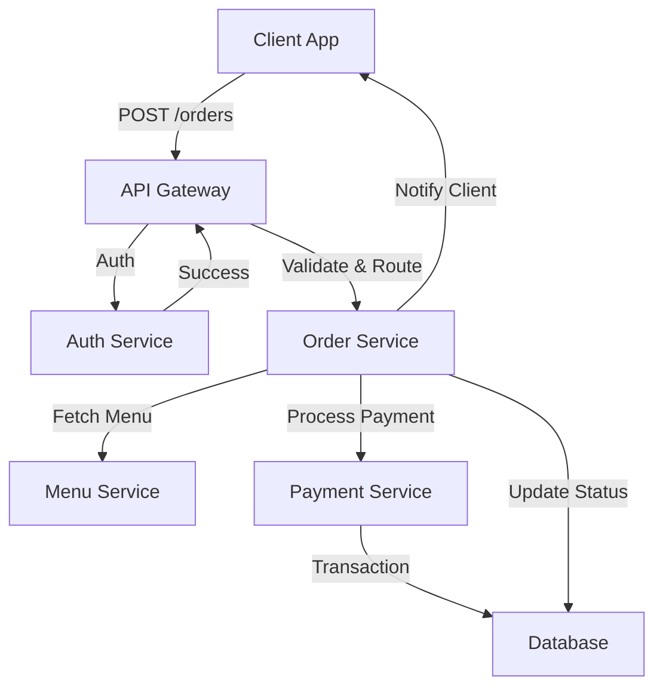

# API Design 101: From Basics to Best Practices

> Video Reference: [API Design 101: From Basics to Best Practices](https://www.youtube.com/watch?v=7QfswaV0re4)

## 1. Asli Problem Kya Hai? (The Core Why)

Imagine Swiggy ke order placement flow ko. Jab user “Place Order” click karta hai, backend ko:
- **User validation** (auth, address)
- **Restaurant availability** (menu, stock)
- **Delivery slot** (driver location, ETA)
- **Payment** (gateway, wallet)

ye sab ek saath hit karna padta hai. Agar APIs poorly designed ho, toh:
- **Latency spikes**: ek API ko 200 ms lagne se whole flow 2× slow ho jata hai.
- **Rate limits**: 10k requests/s ko handle nahi kar paate, traffic drop ho jata hai.
- **Monolithic coupling**: ek service fail hoti hai, poora order process fail ho jata hai.

Result: poor UX, cancellations, lost revenue. Isliye clean API design zaroori hai.

## 2. Core Architecture & Mechanisms

### 2.1 Statelessness
- **Stateless** API means har request self‑contained. No session stored in server RAM.
- FaaS, Kubernetes pods scale easily. If a pod crashes, another pod can pick up next request.

### 2.2 Versioning
- **/v1/**, **/v2/** – backward compatibility. Swiggy ka “menu” API pehle v1 se start hua, later v2 added filters.
- Helps developers migrate without breaking existing clients.

### 2.3 Pagination & Filtering
- **Limit/Offset** ya **Cursor**. Large menu (10k items) return ko batte hai 50 per page. Reduces payload, lowers latency.
- Example: `GET /restaurants?lat=...&lng=...&limit=50&cursor=abc123`.

### 2.4 Idempotency
- Order placement is **POST /orders**. If network glitch, client retries – server must recognize same request (via Idempotency-Key header) and avoid double charges.

### 2.5 Circuit Breaker & Retry
- If payment gateway down, **circuit breaker** opens after 3 failures. Subsequent calls return 503. After cooldown, retry.
- Prevents cascading failures in microservices ecosystem.

### 2.6 Rate Limiting & Throttling
- **Token Bucket** algorithm. Swiggy’s API gateway limits each user to 5k requests/hr.
- Protects backend from DoS and ensures fair resource usage.

### 2.7 Caching
- **Read‑through cache** (Redis). Restaurant menu cached for 5 min. Subsequent reads hit cache → lower DB load.
- **Cache‑aside** for dynamic data like order status.

### 2.8 API Gateway Pattern
- Single entry point for all services. Handles authentication, rate limiting, routing.
- Example: Kong or NGINX + Envoy.

### 2.9 OpenAPI/Swagger Documentation
- Self‑describing APIs. Swiggy uses Swagger UI for internal devs to test endpoints.

## 3. Architecture Flow

## 4. Production Case Study

### Uber’s Ride‑Matching API
- **Endpoint**: `GET /match?lat=...&lng=...`
- Uses **Geohash** for spatial indexing → fast lookup of nearby drivers.
- Implements **rate limiting** per city to avoid spamming.
- **Circuit breaker** around external mapping service (Google Maps). If map API fails, fallback to offline routing.
- **Cache** for driver availability (Redis). Updated every 5 seconds.

Result: 99.9% uptime, <200 ms average latency even during peak rush hours.

## 5. Trade‑offs (Pros vs Cons)

| Pros | Cons |
|------|------|
| **Stateless APIs** → easy scaling, failover. | Requires more data per request (reduces performance). |
| **Versioning** → backward compatibility. | Multiple versions increase maintenance overhead. |
| **Pagination** → lower payloads, reduced latency. | Clients must handle multiple pages, extra round‑trips. |
| **Idempotency** → safe retries, no double charges. | Needs unique key management, adds complexity. |
| **Circuit Breaker** → protects downstream services. | Can hide bugs if not monitored; may lead to stale data. |
| **Caching** → reduces DB load, faster responses. | Stale data risk, cache invalidation complexity. |
| **API Gateway** → central auth, monitoring. | Single point of failure unless highly available. |
| **OpenAPI Docs** → self‑documenting, easier onboarding. | Requires continuous updates as APIs evolve. |

## 6. System Design Interview Cheat Sheet

- **Start with requirements**: functional, non‑functional, constraints (traffic, latency).
- **Choose stateless vs stateful**: trade‑off between simplicity and performance.
- **Versioning strategy**: `/v1/`, `/v2/` vs semantic versioning.
- **Error handling**: idempotency keys for POST, graceful degradation.
- **Scalability patterns**: API Gateway + load balancer + horizontal scaling.
- **Monitoring & observability**: metrics (latency, error rate), tracing (OpenTelemetry).
