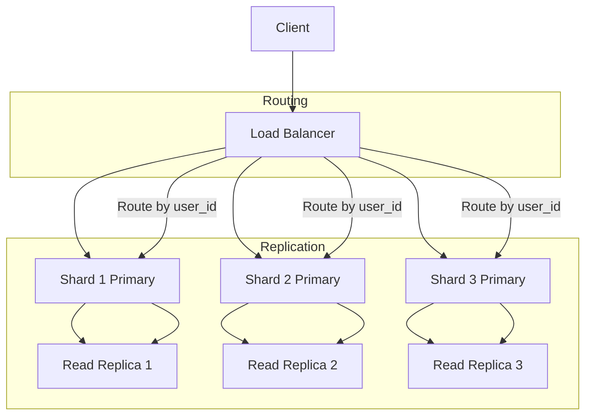

# Database Replication & Sharding Explained

> Video Reference: [Database Replication & Sharding Explained](https://www.youtube.com/watch?v=jLEp1XI_L6Q)

## 1. Asli Problem Kya Hai? (The Core Why)

Think of Swiggy’s order system on a busy night. Har minute mein lakhon orders aate hain, aur har order ke liye payment, inventory, aur delivery status update karna hota hai. Agar hum ek single database server pe sab kuch handle karenge, toh latency badh jayegi, throughput drop karega, aur ek single point of failure ban jayega.  

Agar is problem ko solve na kiya jaye, toh customers ko lagta hi hai ki app freeze ho gaya, orders fail ho rahe hain, aur business loss ho raha hai. Isliye replication (data ka duplicate copies create karna) aur sharding (data ko parts mein split karna) ka use hota hai to spread load, improve availability, aur fault tolerance.

## 2. Core Architecture & Mechanisms

### Replication

- **Primary–Replica Pattern**: Ek master node writes ko handle karta hai, aur read replicas usko sync karte hain. Reads ko replicas pe divert karke read latency reduce hoti hai.  
- **Read Replica**: Load balancer (like Nginx) distributes read queries to replicas.  
- **Gossip Protocol**: Nodes ek dusre ko state share karte hain, taaki replication lag ko minimize karein.  
- **Consistency Models**: *Eventual consistency* (fast writes, read may lag) vs *Strong consistency* (latency higher but data fresh).

### Sharding

- **Horizontal Sharding**: Rows ko split karte hain across multiple shards based on a key (e.g., user_id).  
- **Shard Key Selection**: User ID ya Order ID se data evenly distribute hota hai.  
- **Routing Layer**: Application or a dedicated service decides which shard a query should hit.  
- **Rebalancing**: Jab data uneven ho jata hai, sharding algorithm data ko redistribute karta hai.

### Combined Use

- Each shard can have its own replication set (primary + replicas).  
- Global read/write operations are split across shards, improving scalability.

## 3. Architecture Flow

## 4. Production Case Study

**Zomato** uses a combination of replication and sharding for its massive order and review databases.  

- **Sharding**: Orders are sharded by `restaurant_id` so that all orders for a single restaurant live on the same shard, reducing cross-shard joins.  
- **Replication**: Each shard’s primary node writes data and pushes changes to 2 read replicas via asynchronous replication.  
- **Failover**: If a primary goes down, one of the replicas is promoted automatically, ensuring minimal downtime.  
- **Result**: Zomato sees <50 ms read latency even during peak lunch hours and can handle >10k orders per second.

## 5. Trade-offs (Pros vs Cons)

| Pros | Cons |
|------|------|
| *Scalability* – more shards = more horizontal scalability. | *Complexity* – sharding key selection and rebalancing can be hard. |
| *High Availability* – replicas provide failover. | *Data Consistency* – eventual consistency may cause stale reads. |
| *Load Distribution* – read replicas reduce load on primary. | *Operational Overhead* – managing multiple shards and replicas. |
| *Fault Isolation* – failure in one shard doesn’t affect others. | *Query Complexity* – joins across shards require special handling. |
| *Cost Efficiency* – cheaper to scale out with commodity hardware. | *Latency* – cross-shard communication can add latency. |

## 6. System Design Interview Cheat Sheet

- **Identify the bottleneck**: Is it reads, writes, or both?  
- **Choose replication type**: Master–replica for read scaling, multi-master for write scaling.  
- **Pick a shard key**: Must distribute load evenly and be part of primary key.  
- **Plan for rebalancing**: Use consistent hashing or a dedicated rebalancing tool.  
- **Define consistency requirements**: Decide between strong and eventual consistency based on business needs.
