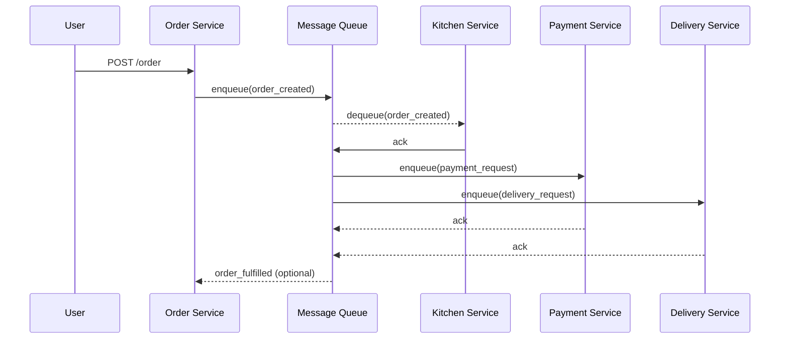

# Message Queues in System Design

> Video Reference: [Message Queues in System Design](https://www.youtube.com/watch?v=DYFocSiPOl8)

## 1. Asli Problem Kya Hai? (The Core Why)

Swiggy ka order placement system socho. Jab ek user “Order” button dabata hai, toh ek request pehli hi backend ko reach karti hai. Agar har order ke liye immediately kitchen ko notification, payment gateway ko charge, aur delivery partner ko assign karna pade, toh system pe load badh jayega. High traffic time pe (5 PM – 7 PM) 10,000 orders per minute aate hain, aur agar sab synchronous ho, toh latency badh jaati hai, users ko “Processing” ka message aata rahega aur order drop ho sakta hai. Is problem ko solve na karne se:

- **Time‑to‑Service (latency)** badh jaata hai → users churn.
- **Throughput** limited hota hai → peak traffic pe system crash.
- **Scalability** mushkil ho jati hai, aur bugs easily surface hote hain.

Yehhi reason hai jiske liye message queues introduce ki jaati hain: asynchronous, decoupled, aur scalable processing.

## 2. Core Architecture & Mechanisms

Message queues ek **buffer** ki tarah kaam karte hain jisme producers (e.g., order service) messages put karte hain, aur consumers (e.g., kitchen, payment, delivery services) unhe asynchronously process karte hain. Key mechanisms:

### 2.1 Producer & Consumer

- **Producer**: Jo event generate karta hai (order placed). Yeh message ko **enqueue** karta hai.
- **Consumer**: Jo queue ko **poll** karta hai, message ko **dequeue** karke process karta hai. Multiple consumers ho sakte hain for load distribution.

### 2.2 Acknowledge & Retry

- After processing, consumer sends **ACK** to queue. Agar ACK nahi milta (failure), message **re‑queued** hota hai ya dead‑letter queue mein jata hai.
- Retry logic ensures reliability.

### 2.3 Ordering & Partitioning

- **FIFO** queues maintain order; **Topic** queues allow multiple consumers to receive same message (pub/sub).
- Partitioning (Kafka style) helps horizontal scaling: messages are split across partitions based on key.

### 2.4 Durability & Persistence

- Messages ko **disk** ya **replicated storage** pe store kiya jata hai, jisse system crash ke baad bhi data lost nahi hota.
- **Broker** (e.g., RabbitMQ, Kafka) handles persistence and replication.

### 2.5 Back‑pressure & Flow Control

- If consumers lag rahe hain, queue length badhti hai. Producers ko **throttle** ya **batch** karna padta hai.
- Load balancers aur auto‑scaling consumers help handle spikes.

## 3. Architecture Flow

## 4. Production Case Study

**Zomato** uses **Kafka** as its backbone for order processing. When a customer places an order, the order service publishes an `order.created` event to a Kafka topic. Multiple downstream services (restaurant inventory, payment gateway, rider assignment) consume this event independently. If the payment service fails, the message is retried automatically. Kafka’s partitioning allows Zomato to scale consumer groups horizontally, handling millions of orders daily without blocking the UI. They also use **Dead Letter Queues** to capture problematic messages for later analysis, ensuring no order gets silently dropped.

## 5. Trade-offs (Pros vs Cons)

| Pros | Cons |
|------|------|
| **Scalability** – Consumers scale independently; handle spikes. | **Complexity** – Requires managing brokers, partitions, and retries. |
| **Reliability** – Persistent storage prevents data loss. | **Latency** – Asynchronous processing may add delay between event and final state. |
| **Decoupling** – Services evolve independently. | **Consistency** – Eventual consistency; may need additional coordination. |
| **Back‑pressure handling** – Queue length signals load. | **Operational overhead** – Need monitoring, alerting, and tuning. |
| **Replayability** – Events can be replayed for debugging or reprocessing. | **Cost** – Running brokers, storage, and networking can be expensive. |

## 6. System Design Interview Cheat Sheet

- **Define the problem**: high traffic, need for decoupling, latency vs consistency trade‑off.
- **Choose queue type**: point‑to‑point (RabbitMQ) vs publish/subscribe (Kafka).
- **Model events**: idempotent, versioned, with metadata (timestamp, correlation id).
- **Handle failures**: ack, retry, dead‑letter queues, monitoring.
- **Scale consumers**: use consumer groups, partitioning, autoscaling; keep idempotency to avoid duplicate processing.
