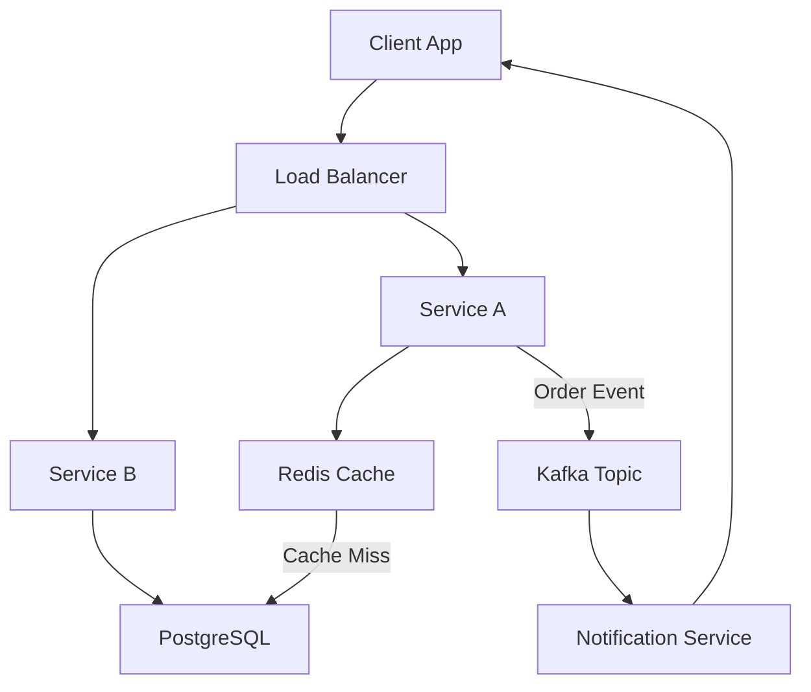

# 6 System Design Interview Concepts

> Video Reference: [6 System Design Interview Concepts](https://www.youtube.com/watch?v=HpE0TAuBv3c)

## 1. Asli Problem Kya Hai? (The Core Why)

High‑traffic Indian products jaise **Swiggy, Zomato, IRCTC, Paytm** ko har second lakhon requests handle karne padte hain. Agar hum in problems ko ignore karein, toh aise scenarios hotay hain:

- **Latency spikes** se order cancellation badh jati hai – customers turant cancel kar lete hain.
- **Data inconsistency** se seat booking double ho jati hai – IRCTC ke tickets double book ho sakte hain.
- **Scalability issues** se peak hours mein app crash ho jata hai – Paytm ka “One‑Day‑Sale” ke dauran app down ho jata hai.

Yeh hi wajah hai ki interviewers aapse poochte hain: *“Aap system ko kaise design karenge taaki yeh sab problems solve ho?”* Hum 6 core concepts pe focus karte hain jo har design ke backbone hote hain.

## 2. Core Architecture & Mechanisms

### 2.1 Latency vs Throughput
- **Latency**: Time lag between request aur response. Swiggy ke “food arrives within 30 mins” promise ko meet karne ke liye low latency zaroori hai.
- **Throughput**: Number of requests handled per second. Paytm’s “Flash Sale” mein millions of transactions ek saath process karna hota hai.

**Intuition**: Agar latency high ho, user experience degrade hota hai. Agar throughput low ho, system traffic ko handle nahi kar pata. Balancing dono ka key hai.

### 2.2 Consistency vs Availability (CAP)
- **Consistency**: Har node pe same data ek saath. Zomato’s menu updates ko sab users ke liye sync rehna chahiye.
- **Availability**: System hamesha request ko accept kare. Ola’s ride‑hailing system must always respond, even if some replicas lagging.

**Trade‑off**: In highly distributed systems, aapko decide karna hota hai ki aap consistency chahte hain ya availability. Raft/Gossip protocols help manage this balance.

### 2.3 Partition Tolerance
Network failures ya latency spikes se nodes “partition” ho sakte hain. Partition tolerance ka matlab hai: *“System ko partition hone ke bawajood bhi function karna chahiye.”* IRCTC uses multiple data centers across India to avoid single point of failure.

### 2.4 Load Balancing
- **Round‑Robin**: Simple, evenly distribute traffic.
- **Least‑Connection**: Prefer servers with fewer active connections – useful for Ola’s dynamic ride‑matching.
- **Geo‑Based**: User’s nearest server se request handle karna – Paytm uses this for faster response.

### 2.5 Caching
- **In‑Memory Cache**: Redis or Memcached se hot data (e.g., menu items) quickly serve.
- **Cache‑Aside**: Application first checks cache, otherwise fetches from DB and updates cache. Zomato uses this to reduce DB load.

### 2.6 Event‑Driven Architecture (Kafka/Apache Pulsar)
Decouple services, enable real‑time updates. Swiggy’s order status updates use Kafka streams to push notifications instantly.

## 3. Architecture Flow

- **Client**: Swiggy app
- **Load Balancer**: Distributes traffic to services
- **Cache**: Redis holds hot data
- **Kafka**: Handles order events asynchronously
- **Notification Service**: Pushes real‑time updates

## 4. Production Case Study

**Paytm (Payments & Wallets)**

- **Latency**: Uses CDN + edge servers in multiple cities to keep response < 200ms.
- **Consistency**: Strong consistency for wallet balance via distributed transactions (two‑phase commit) across microservices.
- **Availability**: Multi‑region deployment with automatic failover.
- **Load Balancing**: Layer‑7 LB with session stickiness for user-specific data.
- **Caching**: Redis cluster for session tokens and hot transaction data.
- **Event‑Driven**: Kafka for payment flow, audit logs, and fraud detection.

Paytm’s architecture allows them to process **hundreds of millions** of transactions daily while maintaining a 99.9% uptime.

## 5. Trade‑offs (Pros vs Cons)

| Concept | Pros | Cons |
|---------|------|------|
| Latency vs Throughput | Faster response, better UX | Higher cost (more servers) |
| Consistency vs Availability | Reliable data, no double bookings | Potential downtime during partitions |
| Partition Tolerance | System survives network splits | Added complexity in consensus |
| Load Balancing | Even traffic, avoids hot spots | Requires health checks & routing logic |
| Caching | Reduced DB load, lower latency | Cache staleness, extra memory |
| Event‑Driven | Loose coupling, real‑time updates | Complexity in debugging, eventual consistency |

## 6. System Design Interview Cheat Sheet

- **Remember**: *Latency + Throughput = User Satisfaction* – optimize both, not just one.
- **CAP**: In real world, choose *Consistency + Availability* (CA) or *Consistency + Partition tolerance* (CP) based on use‑case.
- **Load Balancer**: Use **Geo‑based** for global apps, **Least‑Connection** for dynamic workloads.
- **Cache‑Aside**: Always invalidate or update cache on write to avoid stale data.
- **Event‑Driven**: Use Kafka/ Pulsar for high‑volume, decoupled services; design idempotent consumers.
