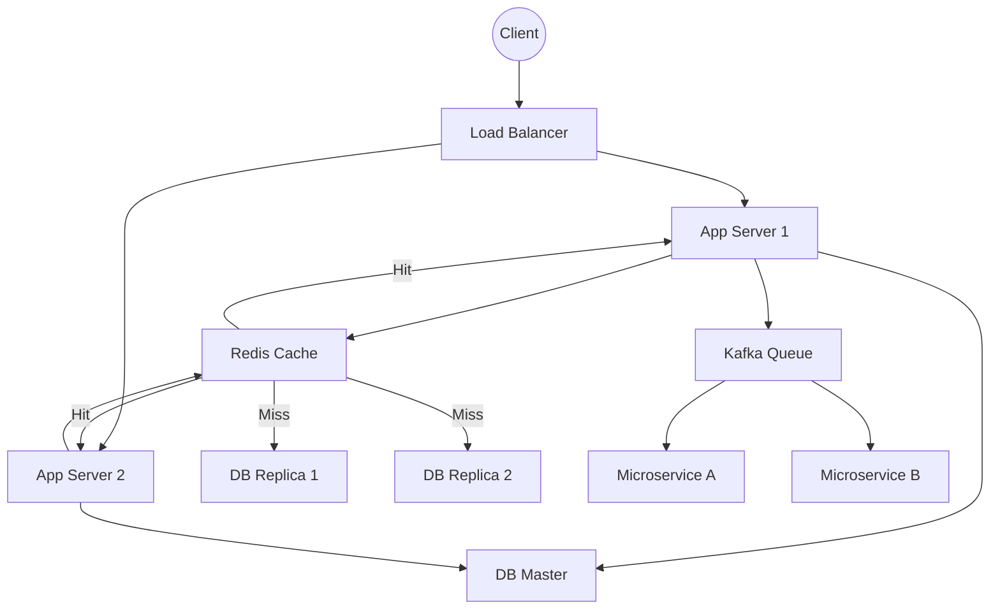

# System Design Concepts: Architecture of Production Web Apps

> Video Reference: [System Design Concepts: Architecture of Production Web Apps](https://www.youtube.com/watch?v=xGqmdt_7auc)

## 1. Asli Problem Kya Hai? (The Core Why)

Socho ek Swiggy clone hai jo din mein 10 lakh orders handle karta hai. Agar hum isko ek single server pe run karein, to **latency** badhegi, **throughput** kam hoga aur kabhi kabhi crash ho jayega. Log ka wait time 5‑10 second se 30+ second tak badh jayega, aur customers ka trust bhi lose ho jayega. Agar hum load ko distribute na karein aur data ko efficiently store na karein, to **availability** bhi compromise hogi – jaise IRCTC ka seat booking system peak time pe down ho jata hai. Toh problem yeh hai: *High traffic, low latency, high availability* ek production web app ke liye.

## 2. Core Architecture & Mechanisms

### Load Balancer
Load balancer incoming requests ko multiple application servers pe evenly distribute karta hai. Ye ek *Ola* dispatcher ki tarah kaam karta hai – sabhi drivers ko ek traffic signal se queue mein bhejta hai taki koi bhi driver overload na ho.

### Stateless Application Servers
Each server ko stateless banaya jata hai. Session data external store (Redis, Memcached) mein rakha jata hai. Isse scale-out karna easy hota hai – ek naya server add karte hi traffic automatically uss server pe shift ho jata hai.

### Caching Layer
Frequently accessed data (menu items, user profiles) ko cache kiya jata hai. Redis ya Memcached use hota hai. Isse **latency** 10‑20ms ke andar rehta hai, jaise Paytm ka instant QR payment.

### Database Sharding & Replication
Large tables ko **shard** kiya jata hai – har shard ek separate server pe hota hai. **Read replicas** se read traffic ko distribute kiya jata hai. Write operations ek master node pe jaate hain, read operations replicas se. Yeh **consistency** aur **availability** balance karta hai, jaise Zerodha ka order book system.

### Gossip Protocol & Service Discovery
Microservices ke beech state share karne ke liye gossip protocol use hota hai. Isse services apni health aur configuration automatically discover kar leti hain, jaisa ki Netflix ke microservices automatically new instances ko register karte hain.

### Asynchronous Messaging
Heavy background jobs (order notifications, analytics) ko **message queues** (Kafka, RabbitMQ) se handle kiya jata hai. Yeh system ko resilient banata hai – agar ek service fail ho jaye to message queue usko retry karta hai.

### Health Checks & Auto‑Scaling
Each instance health check se pass karega. Cloud provider (AWS EC2, GCP) automatically scale-up/down karega based on CPU/memory metrics. Ye 24/7 uptime ensure karta hai, jaise WhatsApp ka global infrastructure.

## 3. Architecture Flow

## 4. Production Case Study

**Uber** ne apne ride‑hailing platform ke liye ek similar stack adopt kiya:

- **Load Balancer**: Elastic Load Balancer (ELB) to distribute traffic across **stateless** Go microservices.
- **Caching**: Redis used for driver location, surge pricing data.
- **Databases**: PostgreSQL for transactional data, Cassandra for high write throughput (trip logs).
- **Read Replicas**: Multiple read replicas of PostgreSQL handle 80% read traffic.
- **Message Queue**: Kafka streams order events to analytics and recommendation services.
- **Auto‑Scaling**: AWS Auto Scaling Groups based on CPU and request latency.
- **Observability**: Prometheus + Grafana for metrics; Jaeger for tracing.

Result: 99.99% uptime, sub‑200 ms latency during peak hours, and ability to scale to millions of concurrent rides.

## 5. Trade‑offs (Pros vs Cons)

| Pros | Cons |
|------|------|
| **Scalability** – Easy horizontal scaling with stateless services | **Complexity** – Multiple moving parts to orchestrate |
| **High Availability** – Replicas & auto‑scaling reduce single points of failure | **Latency** – Extra hops (cache, DB replicas) can add micro‑seconds |
| **Fault Tolerance** – Message queues & retries protect against transient failures | **Operational Overhead** – Monitoring, alerting, and capacity planning needed |
| **Performance** – Caching reduces DB load | **Consistency** – Eventual consistency may affect real‑time data |
| **Cost‑Effectiveness** – Use of cloud autoscaling reduces idle resources | **Learning Curve** – Engineers need to master distributed systems concepts |

## 6. System Design Interview Cheat Sheet

- **Start with Requirements** – Traffic, latency, consistency, scaling.
- **Use Load Balancer + Stateless App Servers** – Simplify scaling.
- **Cache Hot Data** – Redis/Memcached for sub‑10 ms lookups.
- **Shard & Replicate DB** – Sharding for write scale, read replicas for read scale.
- **Decouple with Messaging** – Kafka/RabbitMQ for background jobs & resilience.
