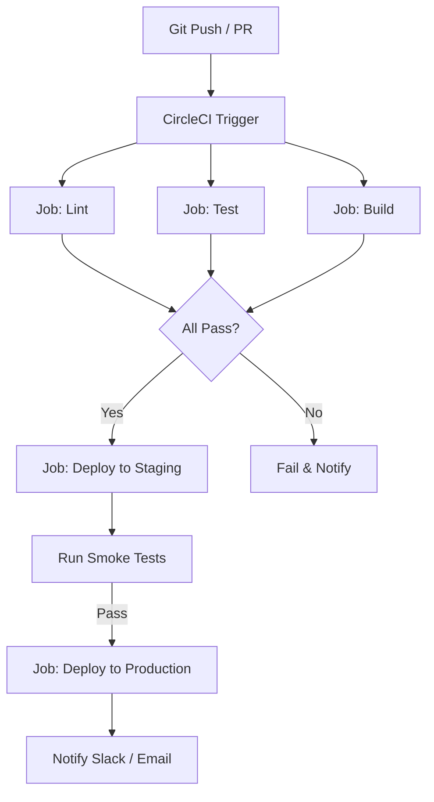

# CI/CD Pipeline: Building a Real-World Example with CircleCI

> Video Reference: [CI/CD Pipeline: Building a Real-World Example with CircleCI](https://www.youtube.com/watch?v=Z90oD_ovLBg)

## 1. Asli Problem Kya Hai? (The Core Why)

Imagine Swiggy’s delivery app. Har minute 10,000 orders aane lagte hain, aur har order ke liye 2-3 micro‑services ko update karna padta hai – menu, pricing, driver‑matching, payment, notifications. Agar code changes manually deploy kiye jaate, toh ek galti se 30 minutes tak delivery delay ho sakti hai, users cancel kar denge, aur revenue drop ho jayega.  
CI/CD ka main purpose hai: **rapid, reliable, repeatable deployments** – taa ki har push pe production ready hota rahe, latency kam ho, aur throughput high rahe.  

## 2. Core Architecture & Mechanisms

CircleCI ek cloud‑based CI/CD platform hai jo GitHub/GitLab se integrate hota hai. Iska core flow:

1. **Trigger** – Code push ya PR create hone par pipeline start hota hai.  
2. **Jobs** – Har job ek isolated environment (Docker container) mein run hoti hai:  
   - **Lint**: syntax errors check.  
   - **Test**: unit & integration tests.  
   - **Build**: Docker image build.  
   - **Deploy**: image push to registry + deploy to staging/production.  
3. **Caching & Artifacts** – Build artifacts ko store karke subsequent jobs ko fast banaya jata hai.  
4. **Parallelism** – Multiple jobs ek saath run hoti hain, jisse overall build time kam hota hai.  
5. **Orchestration** – `config.yml` file se workflows define hote hain, jisme dependencies set ki jaati hain (e.g., deploy only after tests pass).  

### Key Concepts

- **Artifacts** – Files (reports, binaries) that survive across jobs.  
- **Caches** – Reusable layers (node_modules, Maven dependencies) to speed up builds.  
- **Contexts** – Shared environment variables (API keys, DB creds).  
- **Orbs** – Reusable packages of jobs/commands (e.g., AWS deploy orb).  

## 3. Architecture Flow

## 4. Production Case Study

**Zomato** uses CircleCI to automate their micro‑service deployments.  
- **Workflow**: GitHub push → lint → unit tests → Docker build → push to ECR → deploy to ECS using CloudFormation.  
- **Outcome**: Deployment time reduced from 30 mins to ~5 mins.  
- **Rollback**: Automatic rollback on failed health checks, thanks to ECS service auto‑rollback.  
- **Observability**: CircleCI logs integrated with Datadog for real‑time monitoring.  

## 5. Trade-offs (Pros vs Cons)

| Pros | Cons |
|------|------|
| Fast, repeatable deployments with minimal manual effort | Cloud costs (CI minutes, storage) |
| Easy integration with GitHub/GitLab and existing toolchain | Learning curve for `config.yml` syntax |
| Built‑in parallelism & caching reduces build time | Limited on‑premise options (mostly SaaS) |
| Automatic rollback & health‑check support | Requires good test coverage to be effective |
| Rich ecosystem of Orbs for common tasks | Debugging failures can be tricky due to isolated envs |

## 6. System Design Interview Cheat Sheet

- **CI/CD pipeline stages**: Trigger → Build → Test → Deploy → Monitor.  
- **Parallelism & caching**: Use Docker layers & CircleCI caches to cut build time.  
- **Rollback strategy**: Deploy to staging first, run smoke tests, then promote to prod with health‑check validation.  
- **Observability**: Capture logs, metrics, and alerts; integrate with monitoring tools (Datadog, Prometheus).  
- **Security**: Store secrets in CircleCI contexts; never commit credentials in repo.
