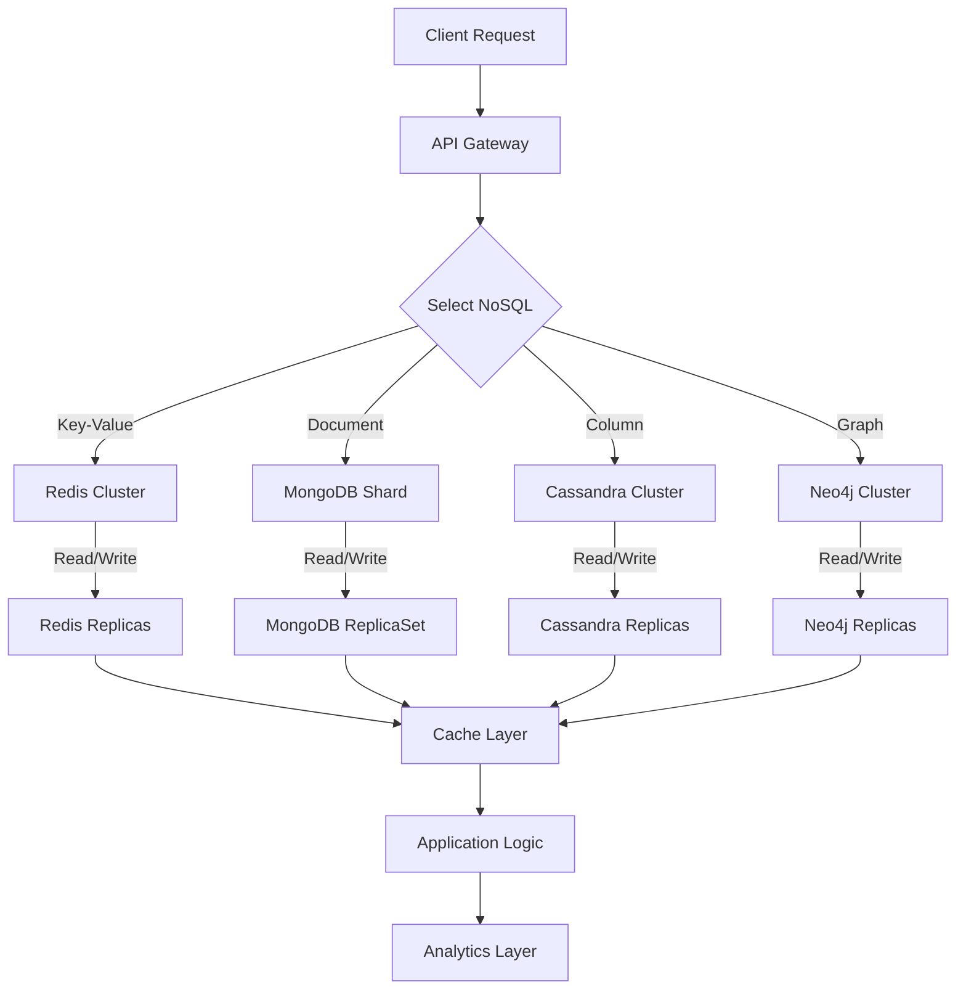

# NoSQL Databases Explained: All Types & When to Use Them

> Video Reference: [NoSQL Databases Explained: All Types & When to Use Them](https://www.youtube.com/watch?v=08Ti49jhE8s)

## 1. Asli Problem Kya Hai? (The Core Why)

Imagine Swiggy ke order flow ko dekhte hain. Ek user 12:00 PM pe “Burger” order karta hai. Swiggy ko turant:

1. **Order ID** generate karna
2. **Restaurant availability** check karna
3. **Delivery rider** assign karna
4. **Payment status** update karna

Sab kuch milliseconds mein. Agar hum relational database pe hi sab handle karein, toh:

- **Jo tables**: `orders`, `restaurants`, `riders`, `payments` – har insert ke sath joins
- **Latency**: 200-300 ms per request (worst case)
- **Scalability**: 1 lakh orders per minute → 1.5 lakh writes per second

Yeh ek *high-traffic* Indian product ka typical problem hai. Agar hum *NoSQL* use na karein, toh shayad:

- **Throughput** drop ho jaata
- **Consistency** issues (duplicate orders, wrong rider assignment)
- **Operational overhead** badh jayega (sharding, replication)

So, NoSQL ki zarurat ka reason: *massive scale*, *low latency*, *flexible schema*.

## 2. Core Architecture & Mechanisms

NoSQL databases 4 main types hain. Har ek ka *core idea* aur *mechanism* alag hai.

### 2.1 Key-Value Stores

- **Concept**: Simple key → value mapping. No query language, just `GET`/`PUT`.
- **Mechanism**: In-memory hash tables + optional disk persistence. Replication through *Gossip Protocol*.
- **Use case**: Session storage (Swiggy login sessions), cart data, simple counters.

> **Analogy**: Like a digital locker – you put something in (value) and retrieve with a unique locker number (key).

### 2.2 Document Stores

- **Concept**: Store JSON/BSON documents. Each document is a *self-contained* record.
- **Mechanism**: Indexing on document fields. Sharding by document ID. Supports flexible schema.
- **Use case**: User profiles (Zerodha), restaurant menus (Swiggy), order metadata.

> **Analogy**: Think of a WhatsApp chat backup – each chat is a document with all messages inside.

### 2.3 Column-Family Stores

- **Concept**: Data organized in *row key* + *column families*; each column family can have varying columns.
- **Mechanism**: Wide rows, sorted key-value storage. Uses *Bloom Filters* to skip empty columns.
- **Use case**: Time-series logs (IRCTC ticket booking logs), user activity streams.

> **Analogy**: Like a spreadsheet where each row is a user, and each column family is a set of related metrics.

### 2.4 Graph Databases

- **Concept**: Nodes and edges with properties. Optimized for traversals.
- **Mechanism**: Index-free adjacency; each node stores pointers to neighbors.
- **Use case**: Social recommendation (Paytm), ride network (Ola/Uber), fraud detection.

> **Analogy**: Map of cities (nodes) connected by roads (edges). Finding shortest path is easy.

### 2.5 Time-Series Databases

- **Concept**: Store data points indexed by timestamp.
- **Mechanism**: Compression, downsampling, retention policies.
- **Use case**: Monitoring metrics (Swiggy order latency), stock tickers (Zerodha).

> **Analogy**: A ledger that records every trade minute by minute.

## 3. Architecture Flow

## 4. Production Case Study

**Uber’s Ride Matching System**

- **Problem**: 15 million rides/day, need to match riders with nearby drivers in < 200 ms.
- **Solution**: Uber uses a **key-value store** (Redis) for *driver location cache* and a **graph database** (Neo4j) for *road network*.
- **Architecture**:
  - Driver’s GPS updates go to Redis.
  - Rider’s request triggers a *shortest path* query in Neo4j (fast adjacency traversal).
  - Result (closest driver) is fetched from Redis.
- **Result**: 99.9% of rides matched within 150 ms, even during peak hours.

## 5. Trade-offs (Pros vs Cons)

| Pros | Cons |
|------|------|
| **Scalability**: Shardable horizontally across many nodes. | **Consistency**: Often eventual consistency, need careful design. |
| **Low Latency**: In-memory options (Redis) give sub-ms response. | **Complex Queries**: Limited query capabilities vs RDBMS. |
| **Flexible Schema**: Easy to evolve data model. | **Operational Complexity**: Managing replicas, sharding, backups. |
| **High Throughput**: Can handle millions of ops/sec. | **Data Integrity**: No ACID guarantees by default. |
| **Specialized Use-cases**: Graph, time-series, document etc. | **Vendor Lock-in**: Proprietary APIs, limited portability. |

## 6. System Design Interview Cheat Sheet

- **Identify Data Access Patterns**: Read-heavy, write-heavy, mixed; choose key-value for simple access, document for semi-structured, graph for traversals.
- **Consistency vs Availability**: CAP theorem – pick *Eventual consistency* for high availability; use *Strong consistency* only if needed.
- **Sharding Strategy**: Hash vs Range; ensure even data distribution.
- **Replication & Failover**: Use primary‑secondary, quorum reads/writes, monitor replica lag.
- **Monitoring & Metrics**: Latency, throughput, cache hit/miss ratio, replica health; set alerts early.
